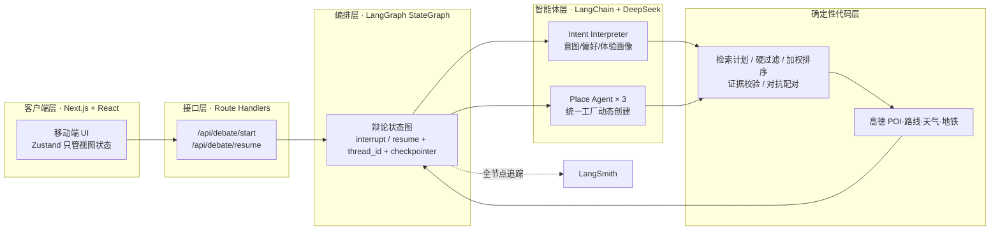
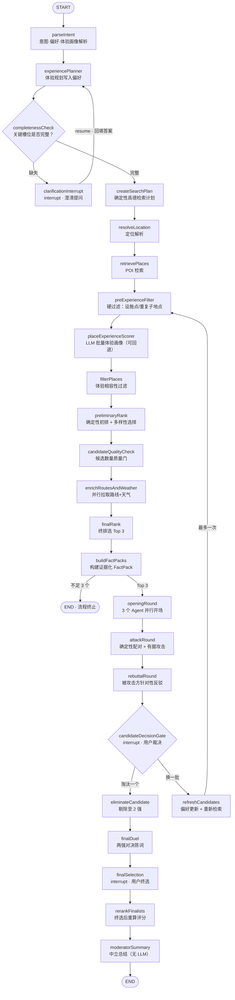

# Place Debate Agent 技术架构 · 面试讲解文档

## 一、项目一句话定位

一个移动优先的「附近去哪儿」决策应用：用户给出当前位置和一句自然语言需求，系统检索真实 POI、确定性排序选出 Top 3，把它们实例化成 3 个互相辩论的 Place Agent（开场 → 攻击 → 反驳），用户可中途介入（澄清意图 / 淘汰候选 / 换一批 / 终选），最后由中立主持人给出权衡总结——最终决定权始终在用户手里。

核心命题：**用「确定性工作流 + 受约束的多智能体辩论」替代单次 LLM 推荐**，让推荐过程可解释、可核验、可干预。

---

## 二、技术栈

| 层 | 技术 |
|---|---|
| 应用框架 | Next.js App Router + TypeScript + React + Tailwind CSS v4 |
| 编排 | LangGraph JS（StateGraph、interrupt/resume、MemorySaver checkpointer） |
| 智能体 | LangChain JS + `@langchain/deepseek`（ChatDeepSeek，temperature 0） |
| 结构化输出 | Zod（所有进入应用代码的 LLM 输出全部过 Schema 校验，不做正则解析） |
| 真实数据 | 高德 Web 服务（POI 搜索 2.0 / 路线规划 / 天气 / 地铁可达性），Key 仅服务端持有；客户端只用高德 JS SDK 画图 |
| 客户端状态 | Zustand（仅 UI 视图状态，与图状态严格分离） |
| 可观测性 | LangSmith（每个节点全链路追踪） |
| 测试 / 部署 | Vitest（确定性逻辑零 LLM 依赖可测）/ Vercel |

---

## 三、整体架构图（分层视角）

分工原则一句话：**图决定「什么时候谁说话」，Agent 只决定「说什么」**。没有自由对话的 agent 群聊，也没有由 supervisor 全权驱动的黑盒流程。

---

## 四、核心流程图（LangGraph 节点流）

三个 `interrupt` 中断点即三次 Human-in-the-loop：**澄清意图 → 候选裁决（淘汰/换一批）→ 最终二选一**。接口层以 `thread_id` 贯穿 `/api/debate/start` 与 `/resume`，用 `Command({ resume })` 从中断点恢复，状态由 MemorySaver checkpointer 持有。

---

## 五、整体框架说明

整个系统是**「确定性骨架 + 受约束的智能体肌肉」**的混合架构：

- **代码负责**：执行顺序、图状态、条件分支、POI 检索与排序、证据存取、中断与恢复。排序权重全部在配置里，不写死在 UI 或 prompt 中。
- **LLM 负责**：理解软性偏好（意图/体验画像）、生成有据可依的辩论语言、按新偏好调整论证。它**从不**决定流程走向，也**从不**直接挑选候选地点。
- **防幻觉边界**：每个 Place Agent 唯一的事实来源是自己那份 `PlaceFactPack`（含路线、天气、评分、价格、地铁可达性及证据 ID）。发言必须携带 `evidenceIds`，服务端断言证据必须真实存在于 FactPack 中（评分、价格、地铁说法逐一核对），证据数量上限 3 条。
- **失败兜底**：体验打分这类「增强型」LLM 调用失败时回退到中性画像，不阻塞主流程；攻击轮产不出有据攻击时回退到确定性攻击文案。

---

## 六、节点逐个说明（按阶段）

### 阶段 1 · 意图理解

| 节点 | 类型 | 职责 |
|---|---|---|
| `parseIntent` | LLM | 一次结构化调用同时产出：IntentProfile（目标/类别/缺失槽位）、ExperienceProfile（体验画像）、UserPreference（结构化偏好），并快照为 `originalPreference` |
| `experiencePlanner` | 确定性 | 根据意图画像对偏好做体验层面的修正（如活动强度、动静倾向），写入 `currentPreference` |
| `completenessCheck` | 确定性 | 只检查会**改变推荐方向**的关键槽位（体验类型/活动类型），已有明确类别或明确指向时不打扰用户 |
| `clarificationInterrupt` | LLM | 第一个中断点：给出带选项的澄清问题；resume 后把答案融合回意图与偏好，回到 `experiencePlanner` 重新规划 |

### 阶段 2 · 检索与排序（LLM 不参与排序决策）

| 节点 | 类型 | 职责 |
|---|---|---|
| `createSearchPlan` | 确定性 | 把意图翻译成高德检索计划：类别 → POI 类型码、关键词、是否严格类别/目标匹配、排除「不去 X」的负向意图 |
| `resolveLocation` | API | GPS → 结构化 LocationContext（高德坐标、adcode、cityCode、格式化地址） |
| `retrievePlaces` | API | 按计划多路检索真实 POI，记录每路查询的命中指标 |
| `preExperienceFilter` | 确定性 | 第一层硬过滤：入口/停车场/厕所等设施点、同名子地点、250m 内疑似同一目的地——在 LLM 消耗结构化输出额度之前剔掉噪声 |
| `placeExperienceScorer` | LLM | 每 15 个一批给 POI 打体验画像；模型漏项/失败时回退中性画像并记入指标，**绝不阻塞主流程** |
| `filterPlaces` | 确定性 | 体验相容性过滤（如「休息」意图剔除纯消费型零售、「探索」意图剔除功能型运动场馆）+ 排除已辩过的 POI |
| `preliminaryRank` | 确定性 | 初排：兴趣契合 0.35 / 距离 0.25 / 活动强度 0.20 / 地点品质 0.15 / 新颖度 0.05，再按类别做多样性选择 |
| `candidateQualityCheck` | 确定性 | 质量门：非严格模式下候选不足 3 个直接失败，**禁止拿不相关地点凑数** |
| `enrichRoutesAndWeather` | API | 并行增强：每个候选拉步行+公交路线（含换乘次数/接驳步行/最快·少步行·少换乘策略），天气按 adcode 全局取一次 |
| `finalRank` | 确定性 | 终排引入真实交通与天气维度（travelFit / weatherFit），支持硬约束（如「地铁零换乘直达」不满足即明确失败），多样性选出 **Top 3** |
| `buildFactPacks` | 确定性 | 把 Top 3 封装为证据化 FactPack（辩论阶段的唯一事实来源），同时记录干预前基准分；条件边：不足 3 个则终止 |

### 阶段 3 · 多智能体辩论

| 节点 | 类型 | 职责 |
|---|---|---|
| `openingRound` | LLM ×3 | 3 个 Place Agent **并行**做第一人称开场陈词；程序把同批事实整理成「相对位次」提示（仅用于选论述重点），发言必须携带证据 |
| `attackRound` | 确定性 + LLM | 先由代码计算对抗配对：枚举 3 强环状攻击方向，按「实质优势分」（距离/评分/步行/地铁零换乘/费用等阈值）选更有信息量的一组，**只保留有据可击的配对**；再由攻击方生成有据攻击 |
| `rebuttalRound` | LLM ×N | 每个被攻击的地点只回应指向自己的那一条攻击，必须回填 `responseToAttackId`/`attackerPoiId`；被质疑路线时只许谈路线，不许拿评分天气转移话题；没有替代优势就明说 |

### 阶段 4 · 用户介入与终局（Human-in-the-loop）

| 节点 | 类型 | 职责 |
|---|---|---|
| `candidateDecisionGate` | interrupt | 第二个中断点：用户看到完整三轮辩论后裁决——「淘汰一个」或「换一批（附反馈）」 |
| `eliminateCandidate` | 确定性 | 剔除被淘汰者，锁定 2 强 |
| `finalDuel` | LLM ×2 | 两强对决：各自先承认对手一个**真实**优势，再论证为什么二选一该选自己 |
| `finalSelection` | interrupt | 第三个中断点：用户在 2 强中终选，`selectedPoiId` 必须属于存活候选 |
| `refreshCandidates` | LLM + API | 「换一批」分支：从反馈文本解析偏好增量 → 更新偏好 → 排除已辩过的 POI 重新检索，**最多允许一次**（`candidateRound` 门禁），回到硬过滤重新走排序管线 |

### 阶段 5 · 总结

| 节点 | 类型 | 职责 |
|---|---|---|
| `rerankFinalists` | 确定性 | 用终选后权重（需求契合 0.26 / 活动强度 0.22 / 交通 0.18+0.12 / 品质 0.10 / 天气 0.12）重算各维度得分 |
| `moderatorSummary` | 确定性 | **不调用 LLM**：排名、各候选优劣势、权衡结论全部由确定性评分拼装，只陈述分数与维度事实——中立角色不被 LLM 修辞带偏，最终决定权留给用户 |

> 备注：源码中还注册了 `userIntervention / updatePreference / detectMissingEvidence / enrichInterventionEvidence` 四个历史迭代遗留节点，当前主流程未接线；现版本的干预后偏好更新在 `refreshCandidates` 内完成。

---

## 七、面试可展开的设计决策

1. **混合架构的边界划得很死**：LangGraph 管状态与调度（含条件边、interrupt/resume），LangChain 管单次模型调用与结构化输出；temperature 0 + 全链路 Zod 校验，模型输出不合格即抛错而不是被容忍。
2. **排序权不交给 LLM**：LLM 只产出「体验画像」这种中间语义特征（且可失败回退），Top 3 由带配置权重的确定性评分决定——可复现、可单测、可解释。
3. **防幻觉三道闸**：① FactPack 是唯一事实来源；② 发言证据预算 ≤3 条且服务端逐一断言（评分/价格/地铁口径必须能在证据中核实）；③ 攻击配对与「是否存在实质优势」由代码算分决定，模型不能凭空开火。
4. **HITL 是一等公民**：三个 interrupt 点覆盖「意图不清晰、候选不满意、最终二选一」三类决策时刻；`thread_id + Command(resume) + MemorySaver` 支撑跨请求恢复，接口层只暴露 start/resume 两个端点。
5. **辩论有收敛机制**：淘汰 → 两强对决 → 终选是一条确定的收敛路径；「换一批」最多一次且强制排除旧候选，杜绝无限循环。
6. **性能与确定性兼顾**：三个 Agent 的开场、全部路线增强均 `Promise.all` 并行；天气等全局事实每次运行只取一次，避免辩论轮次反复打外部 API。
7. **可观测与可测试**：LangSmith 记录每个节点执行；排序、过滤、配对、主持人总结等确定性逻辑完全不依赖 LLM，Vitest 可直接覆盖。
