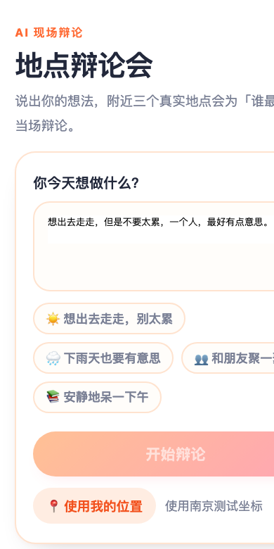
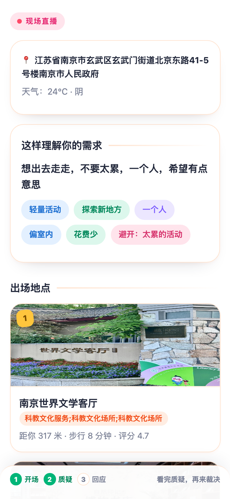
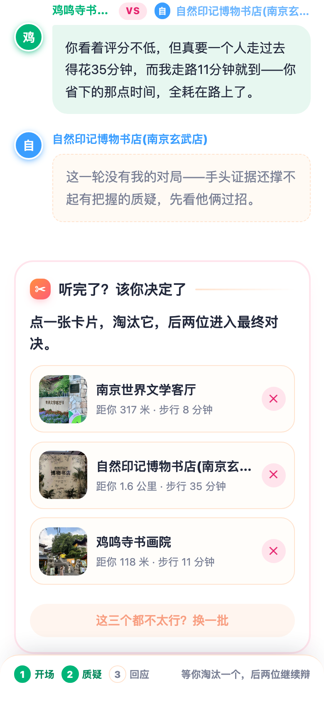
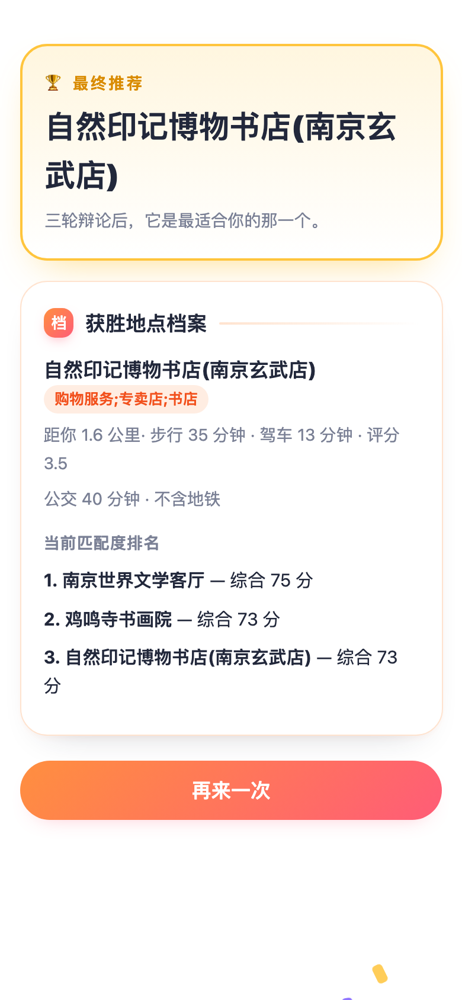
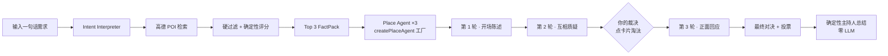

<div align="center">

# 🎙️ Place Debate Agent · 地点辩论会

**说出你的想法，附近三个真实地点当场辩论「谁最适合你」，你来裁决。**

[](https://nextjs.org)
[](https://www.langchain.com/langgraph)
[](https://www.deepseek.com)
[](https://lbs.amap.com)
[](https://taro-docs.jd.com)
[](https://www.typescriptlang.org)
[](https://vitest.dev)

</div>

---

## 它是怎么玩的

1. **你** 用一句话说出今天的想法：*「想出去走走，但是不要太累，一个人，最好有点意思。」*
2. **系统** 解析意图 → 高德检索附近真实地点 → 硬过滤 → 确定性评分 → 选出 Top 3
3. **三个地点** 由各自的 Agent 代言，进行三轮辩论：开场陈述 → 互相质疑 → 正面回应
4. **你** 随时打断：补充信息、淘汰一个、换一批、最终投票
5. **结果** 给出获胜地点的真实档案与匹配度评分——最终选择权永远在你

<div align="center">

| 首页 | 辩论直播 | 点卡片淘汰 | 结果档案 |
|:---:|:---:|:---:|:---:|
|  |  |  |  |

</div>

## 核心设计

**辩论不是装饰，信息架构长在交互上**

- 🚦 **循序渐进的直播** — 三轮对话由用户点击逐步解锁，不是一次性平铺长页；淘汰决策出现在你读完第 2 轮的正下方，点一张卡片即可淘汰
- 🧵 **聊天气泡式对话流** — 每个辩手有专属色（紫 / 蓝 / 绿）浅底气泡与贴纸头像，VS / 回应徽章弹出摆动，缺席辩手也有交代
- 🧮 **代码排名，不让 LLM 排** — POI 由高德检索后经硬过滤 + 确定性评分（需求契合 / 路程便利 / 活动强度 / 天气适配 / 地点品质 / 公共交通六维）选出，LLM 只负责「说」，不负责「选」
- 📎 **证据接地** — Place Agent 只能引用 FactPack 里的证据，价格 / 距离 / 评分 / 地铁全部来自高德真实数据，查不到就明说「无法确认」
- 🤖 **主持人零 LLM** — 最终总结由确定性评分拼装：排名、优劣维度、结论全部来自分数事实，毫秒级返回、零 token 成本
- 🧩 **一个工厂，N 个辩手** — 地点是运行时数据，`createPlaceAgent(factPack, preference)` 按需生成，没有地点专属硬编码类
- ✋ **Human-in-the-loop** — LangGraph `interrupt` / `resume` 实现澄清提问、淘汰决策、最终投票三种打断点

## 架构



**双端同一后端**

| 端 | 技术 | 说明 |
|---|---|---|
| Web | Next.js App Router + Tailwind v4 | `src/`，API 路由即后端（`/api/debate/start`、`/api/debate/resume`） |
| 微信小程序 | Taro 4 + React 18 | `miniapp/`，亮色活泼风多页设计，可构建 weapp，亦可 H5 浏览器预览 |

工作流状态归 LangGraph，UI 状态归各端自身；所有被应用代码消费的 LLM 输出都经 Zod schema 校验。

## 快速开始

```bash
git clone git@github.com:TinyyRick/Place-Debate-Agent.git
cd place-debate-agent
npm install

# 配置密钥
cp .env.example .env.local   # 填入 DEEPSEEK_API_KEY 与 AMAP_WEB_SERVICE_KEY

# 启动后端（小程序默认调用 http://127.0.0.1:3100）
npm run dev -- -p 3100
```

打开 `http://localhost:3100` 即为 Web 版。

### 微信小程序

```bash
cd miniapp
npm install

# 微信端构建（微信开发者工具导入 miniapp/ 目录，详情里勾选「不校验合法域名」）
npm run build:weapp

# 或在浏览器里直接预览（同源代理到 127.0.0.1:3100，无 CORS）
npx taro build --type h5 --watch   # → http://localhost:5200
```

### 环境变量

| 变量 | 必填 | 说明 |
|---|:---:|---|
| `DEEPSEEK_API_KEY` | ✅ | 驱动意图解析与三位辩手 |
| `AMAP_WEB_SERVICE_KEY` | ✅ | 服务端 POI / 路线 / 地铁 / 天气，仅限后端使用 |
| `DEEPSEEK_MODEL` | — | 默认 `deepseek-v4-flash` |
| `LANGSMITH_API_KEY` / `LANGSMITH_TRACING` | — | 开启后可在 LangSmith 查看全链路追踪 |

## 项目结构

```
├── src/                     # Next.js Web 端 + API
│   ├── app/                 # 页面与 /api/debate 路由
│   ├── lib/agents/          # 意图解析 / place-agent-factory / moderator
│   ├── lib/graph/           # LangGraph StateGraph 编排
│   ├── lib/ranking/         # 确定性评分与过滤
│   ├── lib/amap/            # 高德服务端封装
│   └── lib/schemas/         # Zod 结构化输出契约
├── miniapp/                 # Taro 小程序（home / debate / result 三页）
│   └── src/store/debate.ts  # 跨页状态（zustand）
└── docs/screenshots/        # 上面那张图
```

## 开发守则

架构约定、扩展禁令与完成标准见 [AGENTS.md](AGENTS.md) / [TECH_SPEC.md](TECH_SPEC.md)：冻结技术栈、地点不做硬编码 Agent、排名不让 LLM 直接做、密钥不出服务端。

## 测试

```bash
npm run test        # Vitest，68 个用例
npm run typecheck   # tsc --noEmit
```

## Roadmap

- [ ] POI 体验评分的懒加载缓存（按 POI ID 持久化 + 类目级兜底档案）
- [ ] 辩论过程的流式输出
- [ ] LangSmith 评测集与回归实验
